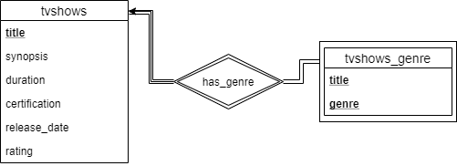
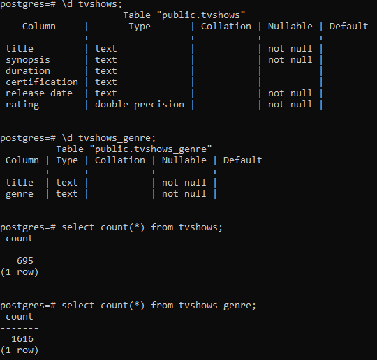
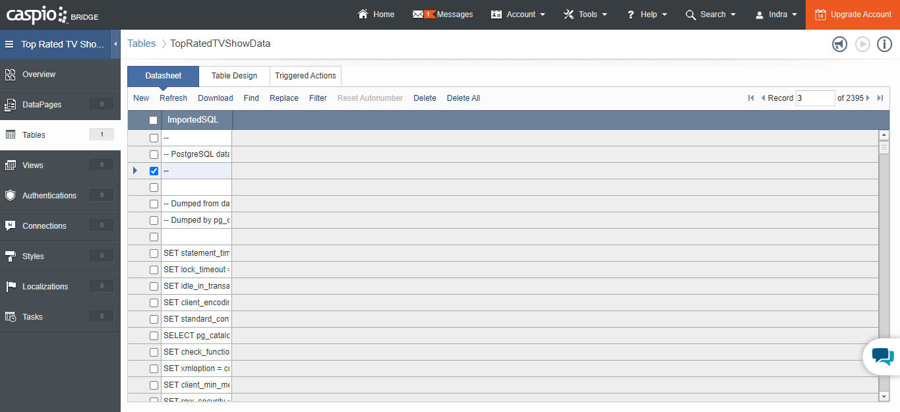

<h1 align="center">
   
  Seleksi 2 Warga Basdat 2020
   
   
</h1>

<h2 align="center">
   
  Data Storing
   
   
</h2>

## Description of the DBMS (Why you choose it)

DBMS yang saya gunakan untuk mengerjakan tugas ini ialah PostgreSQL. Alasan saya menggunakan DBMS ini ialah saya sudah familiar dengan basis data berbasis SQL. Selain itu juga dikarenakan data yang saya _extract_ cocok menggunakan basis data relasional.

Untuk penyimpanan basis data daring, saya menggunakan [Caspio](caspio.com) dikarenakan kemudahan akses basis data, gratis dan tidak memerlukan informasi kartu kredit dalam pendaftarannya.

## Screenshot

*Skema Basis Data*

*Penyimpanan Data ke dalam PostgreSQL*

*Penyimpanan Basis Data ke dalam Cloud Database Online*

## Reference

* json
* [Caspio](caspio.com)
* [draw.io](draw.io)

## Author

*Indra Febrio Nugroho*

*13518016*

<h3 align="center">
   
  Lab Basdat 2020
   
   
</h3>
