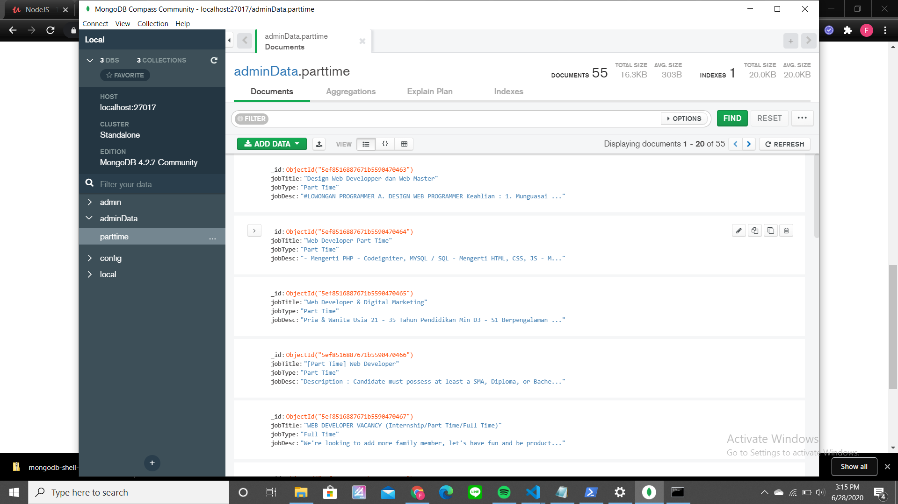

<h1 align="center">
  <br>
  Seleksi 2 Warga Basdat 2020
  <br>
  <br>
</h1>

<h2 align="center">
  <br>
  Data Storing
  <br>
  <br>
</h2>


## Description of The DBMS

  Saya menggunakan mongoDB dikarenakan modul yang disediakan oleh mongoDB itu sudah tersedia di banyak Bahasa Pemrograman. Selain itu juga
  API yang disediakan sangat membantu, misalnya ketika kita ingin menginput data ke database kita telah disediakan method untuk melakukan input tersebut.
  Untuk input banyak data kita sudah disediakan input_one(client,data), sedangkan  untuk input banyak kita sudah disediakan input_many(client,data[]). Ketika
  kita ingin mencari data dari database kita sudah disediakan method find(). Selain itu kita juga bisa melakukan visualisasi data kita yang telah disediakan oleh mongoDB.

## Screenshot
  <p align = "center">

</p>

## Refrence
  1. mongodb : untuk melakukan connect database dengan node js, melakukan insert data ke database, dan membuat API untuk melihat data yang ada di database.

## Author

Fatkhan Masruri - 13518053

## Specifications

### Data Storing

1. Lakukan _storing_ data yang didapatkan dari hasil _scrapping_ (Tugas 1) ke DBMS 

2. Tools yang digunakan __dibebaskan__

3. Dalam pengerjaan tugas, calon warga basdat terlebih dahulu melakukan _fork_ project github pada link berikut: https://github.com/wargabasdat/Seleksi-2020-Tugas-2. Sebelum batas waktu pengumpulan berakhir, calon warga basdat harus sudah melakukan _pull request_ dengan nama ```TUGAS_SELEKSI_2_[NIM]```

4. Pada _repository_ tersebut, calon warga basdat harus mengumpulkan bukti penyimpanan data pada DBMS. _Repository_ Tugas 2 terdiri dari folder `data`, `screenshots` dan `export`
    - _Folder_ `data` berisi data hasil dari _scrapping_
    - _Folder_ `screenshot` berisi tangkapan layar bukti dari penyimpanan data ke DBMS
    - _Folder_ `export` berisi _file_ hasil _export_ dari DBMS (seperti `.sql`, `.json`, (1 saja yang didukung oleh DBMS))

5. Deadline pengumpulan tugas ini adalah __6 Juli 2020 Pukul 23.59__

6. Berikan README yang berisikan konten minimal berupa :
    - Description of the DBMS (Why you choose it)
    - Screenshot (di-upload pada folder screenshots, di-upload file image nya, dan ditampilkan di dalam README)
    - Reference (Library used, etc)
    - Author

7. Task-task berikut bersifat tidak wajib (__BONUS__), boleh dikerjakan sebagian atau seluruhnya
    1. Simpan ke database online
    2. Buatlah API sederhana untuk mengakses database online tersebut
    3. ...
<h3 align="center">
  <br>
  Lab Basdat 2020
  <br>
  <br>
</h3>
